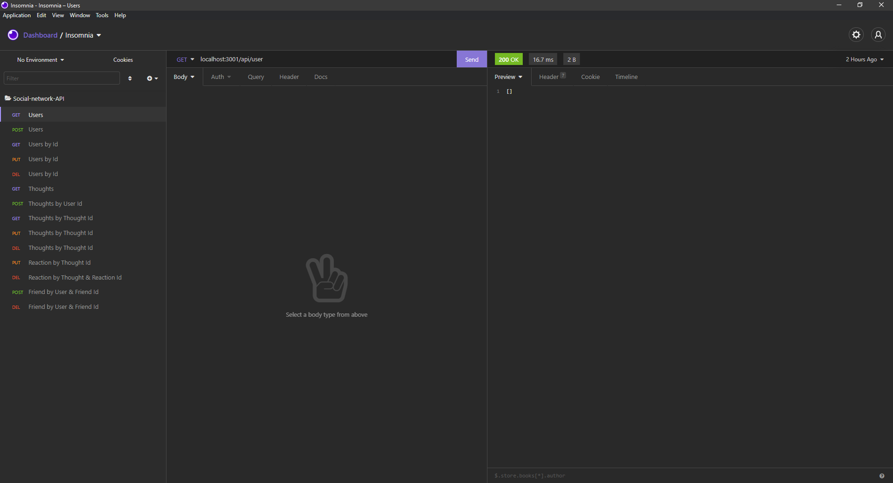

# Social Network API 

## Description 

**NoSQL Challenge: Social Network API**

**Challenge Elements**\
 build an API for a social network web application where users can share their thoughts, react to friends’ thoughts, and create a friend list. You’ll use Express.js for routing, a MongoDB database, and the Mongoose ODM. In addition to using the Express.js (Links to an external site.) and Mongoose (Links to an external site.) packages, you may also optionally use a JavaScript date library of your choice or the native JavaScript Date object to format timestamps.

## Installation

Because this application won’t be deployed, you’ll also need to provide a link to a walkthrough 
video that demonstrates its functionality. I’ll need to submit a 
link to the video and add it to the README of your project.

-The link to the video: https://github.com/AWiebe2021/Social-Network-API/blob/main/Social-Network-API.mp4 \
-The projects code can be accessed at: https://https://github.com/AWiebe2021/Social-Network-API

## Screenshot

## Credits
Solo project
